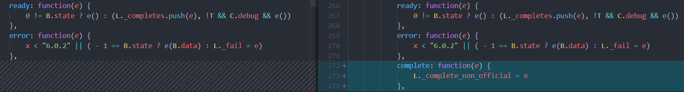
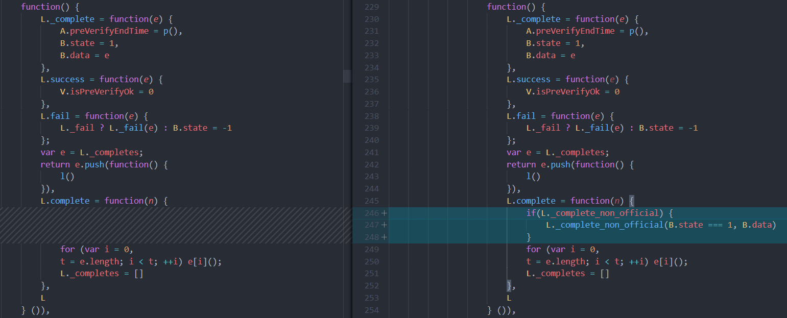

# wxjssdk-copy
可用于npm的wxjssdk版本。代码直接从官方copy过来，方便项目中通过构建工具使用。不知道官方为啥不自己发布一个npm包...

阅读官方使用说明：[wxjssdk](https://developers.weixin.qq.com/doc/offiaccount/OA_Web_Apps/JS-SDK.html); [微信 JS 接口签名校验工具](https://mp.weixin.qq.com/debug/cgi-bin/sandbox?t=jsapisign)

## 使用
安装
```
npm install wxjssdk-copy --save
```
使用：
```js
import wx from 'wxjssdk-copy'

// use wxjssdk with `wx` variable
```

目前此库同步的是官方[1.4.0的版本](https://res.wx.qq.com/open/js/jweixin-1.4.0.js)。


## v1.4.1
在阅读了官方1.4.0的源码之后，发现`wx.ready`和`wx.error`这两个api的设计有问题，一个方法做成了异步、同步混用的两种方式，很容易误导人。 所以在确保改动源码不会影响其它api使用的前提下，新增了一个`wx.complete`的api，使用示例如下：
```js
wx.complete(function(state, data) {
    if(state === true) {
        // config success
        // data refers to config data, like appId etc.
    } else {
        // config error
        // data refers to error info from Wechat client
    }
})
```
这是一个纯异步的回调函数调用设置的方式，而且只需要全局设置一次，在每次调用`wx.config`之后，都会执行这个回调。

改动的源码对比如下：

